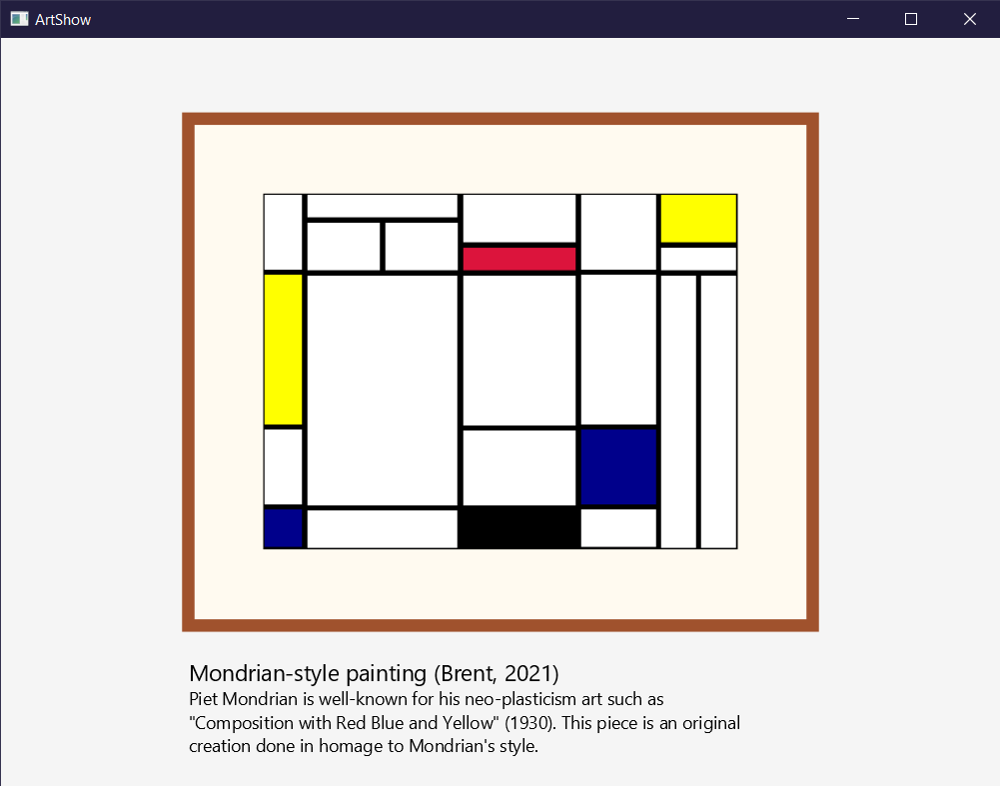

# ArtShow

  Generates a Mondrian-style painting with a frame and matte. Demonstration of JavaFX. 

  <emphasis>TODO: </emphasis> rewrite so the artwork is pseudo-randomly generated but still adheres to Mondrian's style. 

